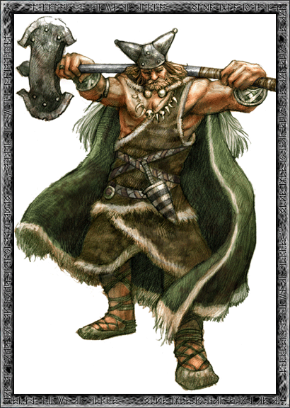
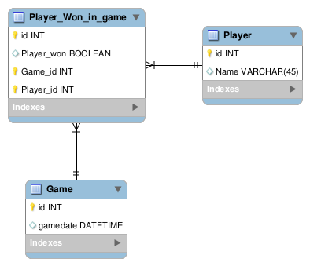

Boer
====

The father of Odin - A Database frontend for tracking outcomes of Age of Empires 2 matches.



## How to install
```bash
export PROJECTNAME=boer

# clone and rename the base framework
git clone https://github.com/pRiVi/ADBGUI.git
mv ADBGUI $PROJECTNAME
cd $PROJECTNAME

# install the nordic boer module
git clone https://github.com/richi235/boer.git

# start setup
install/installscript qx noap
```

## Usage
Start your pagan nemesis with:
```bash
perl dbm.pl
```
## The Database
For counting your martial victories and defeatures boer uses a Database of the following form:  
(Which is created automatically during installation.)  

